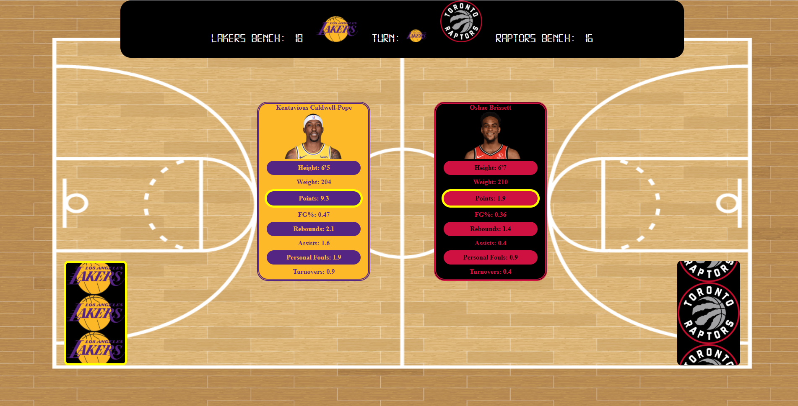

# Balls of War

## Table of Contents
> - [Description](#Description)
> - [Keywords](#Keywords)
> - [Contributors](#Contributors)
> - [Usage](#Usage)
> - [Installation](#Installation)
> - [Test](#Testing)
> - [License](#License)
> - [Deployment](#Deployment)
> - [Questions](#Questions)

## Description
>MERN-Stack Sports themed card game

## Keywords
>*Mongo, Express, ReactJS, NodeJS, SQL, Sequelize, PassportJS*

## Contributors
>Liam Mackinnon, Shamik Haldar, Mohammed-Yasir Suara

## Usage 
>npm start || Heroku deployment (see attached link)

## Installation
>*npm i*

## Testing
>

## License
>Unlicense

## Deployment
https://balls-of-war.herokuapp.com/ 

Screenshot?: Yes

### Questions
>If you have any further questions about the application:
>Email: LMackinnon.inbox@gmail.com
>
>GitHub: www.github.com/liam-mack

proposal
https://docs.google.com/document/d/1BwLD8_vT9-0C1iab5XI0ZbSI9mZ77FO8_oEqO5aeio4/edit#